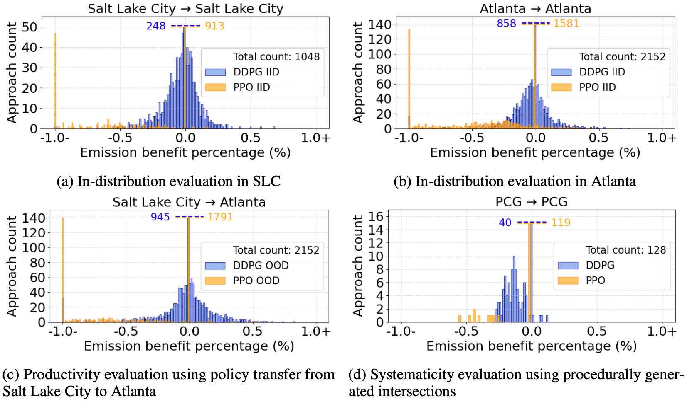

Benchmarking
============

Benchmarking Setup
------------------

We benchmark popular RL algorithms used in multi-agent control to assess their generalization capacity using IntersectionZoo CMDPs. 
Based on the demonstrated success in their application to various cooperative multi-agent problems, we use the Proximal Policy Optimization (PPO) 
algorithm and the Deep Deterministic Policy Gradient (DDPG) algorithm for this purpose. 
To train policies that generalize, we leverage a multi-task learning framework by conditioning the policy on observed context. 

In assessing the performance of the algorithms, we assess their generalization capacity along three axes 
(three forms of targeted evaluations of generalizations). In measuring performance, we illustrate the emission benefits at 
the level of intersection incoming approaches instead of the whole intersection for a better understanding and visualization of the benefit distributions. 

Evaluation Setup
^^^^^^^^^^^^^^^^

The performance of a given CRL policy trained to eco-drive is often benchmarked against human-like driving baselines 
(how much improvement can we obtain from driving differently than humans do). IntersectionZoo provides calibrated Intelligent Driver Models 
as human driving baseline for this purpose. We assess the performance of a policy using the average per vehicle vehicular 
exhaust emission and intersection throughput of each intersection. Refer to `Evaluation Metrics <https://intersectionzoo-docs.readthedocs.io/en/latest/intersectionzoo_architecture.html#evaluation-metrics>`_ section for more details on the definitions of these metrics. 

A key requirement for assessing the performance is to ensure intersection throughput per intersection is never reduced by 
the learned eco-driving policy. If, for any intersection, the throughput is reduced (even if there is low emission), its emission benefits are set to zero.

Benchmarking Results
----------------------

\

The above Figure denotes the performance histograms of PPO and DDPG under different evaluations. 
All emission benefit percentages are measured relative to the human-driving baseline. 
For y-axis counts that are large, we truncate them for better visualization and indicate the count on the plot. The spikes at
0% are in part due to the aforementioned zeroing of emissions benefits for any scenarios where
throughput is reduced. The total approach count is also given in each plot for reference, and the title
indicates train CMDP → test CMDP

**In-distribution performance**: Here, we assess how well the algorithms can generalize when the training and testing context MDPs are the same. 
For this, we leverage Salt Lake City (SLC) CMDP (282 intersections) and Atlanta CMDP (621 intersections) under summer temperature and humidity, 
with 1/3 of vehicles being CVs. Following the IID evaluation protocol, we train and evaluate on the same CMDP. 
The emission benefit histograms are given in Figure (a) for SLC and (b) for Atlanta. 
As can be seen, both PPO and DDPG fail to generalize, and there are many failure cases. 
Failures include having higher emissions and/or lower throughput than the human-driving baseline (0\% benefits case). 
While DDPG has a better success rate than PPO, it is still far from being successful. 
Further, generalization performance in Atlanta is worse than in SLC for both algorithms, 
indicating that different CMDPs may pose different challenges in generalization.    

**Productivity in generalization**: Productivity is when the learned policies generalization beyond seen training data. 
To test this in PPO and DDPG, we perform an OOD evaluation by using a policy trained on SLC CMDP with zero-shot transfer to Atlanta CMDP. 
The resultant performance histogram is given in Figure (c). Note that from previous analysis, it was evident that the DDPG policy trained on SLC 
CMDP seems to perform better than the policy trained on Atlanta CMDP. However, even after the transfer, both DDPG and PPO seem to perform poorly, 
further indicating the limitations of existing RL algorithms when it comes to generalization across problem variations. 

**Systematicity in generalization**: Systematicity is generalization using systematic recombination of known knowledge. 
To test this ability of DDPG and PPO, we leverage IntersectionZoo's capability to procedurally generate context-MDPs. Following, 
we first define a set of context features and their corresponding values as a set of uniform distributions (per feature). 
Then, we train policies by sampling feature values from each distribution. However, certain feature value combinations are never 
used during training. During testing, we only use the feature value combinations that were not used in training. 
This tests the algorithms' ability to systematically combine known knowledge to generalize. The resultant performance 
histogram is given in Figure (d). Both DDPG and PPO fail to systematically generalize; baseline performs better in almost all cases. 

For training reward curves and other metrics, please refer to `this weights and biases report <https://api.wandb.ai/links/vindula/jdyut0t3>`_. An embedded view of the weights and biases report is available below for easy reference. 

.. raw:: html
    <iframe src="https://api.wandb.ai/links/vindula/jdyut0t3" style="border:none;height:2048px;width:100%">
