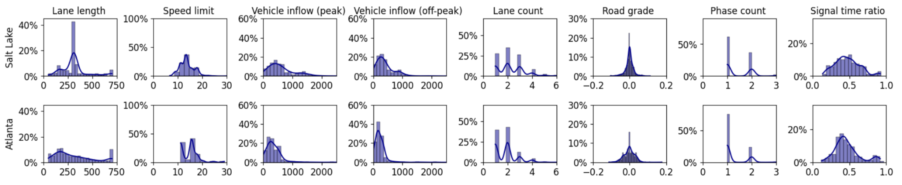
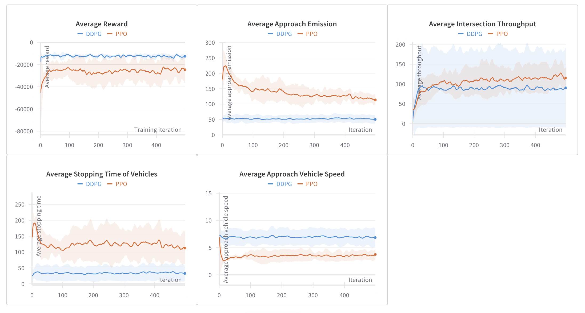
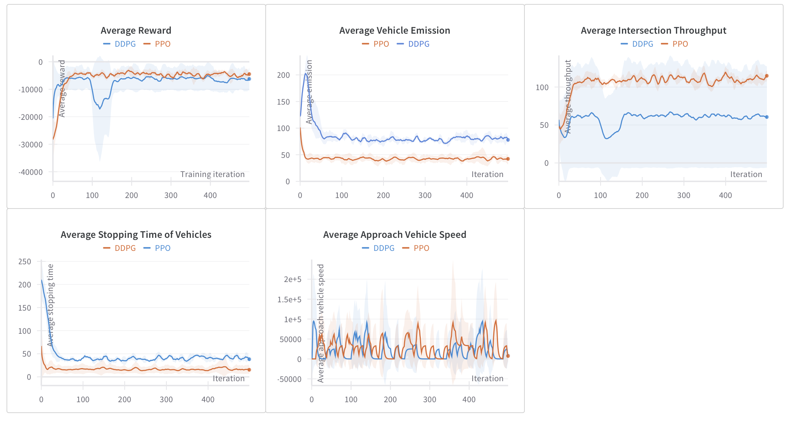

Benchmarking
============

We benchmark PPO and DDPG algorithms on Atlanta and Salt Lake City intersection distributions.
This report contains the training performance curves obtained during this benchmarking, which were measured using five different metrics.

Descriptions of evaluation metrics. 
1. Average reward: Average reward over episodes. A shared reward based on the vehicle fleet is used for each agent. Reward encourages lower emissions, higher speeds, and less stopping and idling.
2. Average approach emission: We measure vehicle exhaust CO2 emissions per vehicle per episode and per time step, but only when a vehicle approaches an intersection. This approach prevents double counting emissions, which can occur as vehicles leaving one intersection may soon approach another.
3. Average approach vehicle speed: Average speed of a vehicle approaching an intersection. Measured as per episode per step. 
4. Average intersection throughput: The average intersection throughput is measured in the number of vehicles that cross the intersection during an episode.
5. Average stopping time of vehicles: The average time a vehicle idle (with zero speed) per episode. Lower idling is often associated with lower emissions as idling emits CO2 (as the engine of the vehicle is still running) without any effective work. 
We use RLLib to implement both PPO and DDPG. For DDPG implementation, we used the RLLib Contribution version. 

**Intersection feature distributions of Salt Lake City and Atlanta**

**Training performance in Salt Lake City CMDP**

**Training performance in Atlanta CMDP **

