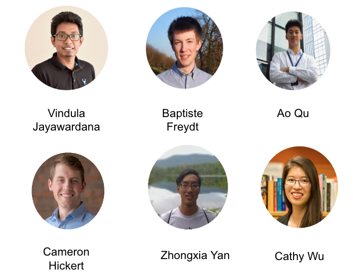

Contact
=======

IntersectionZoo Team
--------------------

IntersectionZoo is actively maintained by the Wu Lab at MIT. 
If you have any questions, comments, or suggestions, please contact Vindula Jayawardana at vindula [AT] mit [DOT] edu. 

Acknowldgements
---------------

The authors thank Blaine Lenoard, Mark Taylor, Michael Sheffield, Christopher Siavrakas, and Kelly Njord at Utah Department of Transportation 
for their constructive feedback on eco-driving scenarios. The authors acknowledge the MIT SuperCloud and Lincoln Laboratory Supercomputing Center 
for providing computational resources to conduct benchmarking provided with IntersectionZoo.

