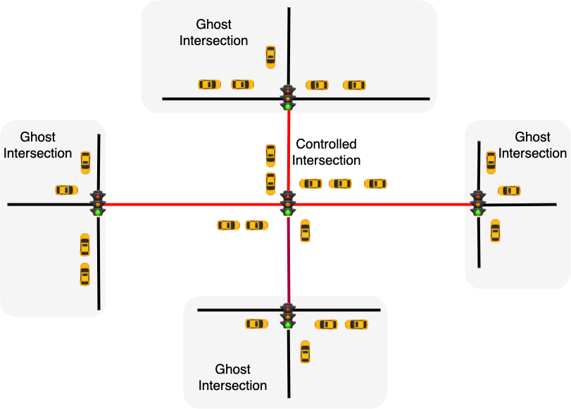

Welcome to IntersectionZoo
===================================

IntersectionZoo is a comprehensive benchmarking suite for multi-agent contextual reinforcement learning, specifically focused on eco-driving applications. Built using real-world data, it offers a flexible and user-friendly platform for developing and comparing contextual reinforcement learning algorithms.

.. note::

   This project is under active development.

Why IntersectionZoo?
------------

Our motivation for developing IntersectionZoo are two fold. 

From reinforcement learning community point of view: While Reinforcement Learning (RL) has shown considerable progress in tackling increasingly complex tasks, 
many RL algorithms in multi-agent settings still struggle with even minor environmental changes, hindering their real-world applicability. 
Despite ongoing efforts to address this challenge, the lack of real-world grounded benchmark problems impedes fair, reliable, and reproducible comparisons of different approaches. 
To fill this gap, in IntersectionZoo, we provide a million traffic scenarios stemming at signalized intersections 
in which the goal is to control a fleet of vehicles to achieve a fleet-level emission reduction objecvtive. 
IntersectionZoo encapsulates these scenarios in their digital twins format and interfaces them as a contextual Markov Decision Process 
to study robustness and generalization as a contextual reinforcement learning problem.

From inteligent transportation systems community point of view: While many studies have reported algorithms for eco-driving (both multi-agent and single-agent formulations),
we increasingly see the need for a benchmark suite that can be used to compare these algorithms in a fair and reproducible manner. Moreover, we observe that many studies hand-pcik the scenarios
for their experiments, which may not be representative of the real-world scenarios and could lead to evaluation overfitting. IntersectionZoo provides a million traffic scenarios stemming at signalized intersections
and that are grounded in real-world data. We believe a IntersectionZoo benchmark suite will standardize the design and evaluation of eco-driving algorithms.

Check out the :doc:`usage` section for further information, including
how to :ref:`installation` the project.

Contents
--------

.. toctree::

   usage
   main_concepts
   simulation_setup
   rllib_integration
   Extensions
   benchmarking
   training_eval
   tutorial
   contact
