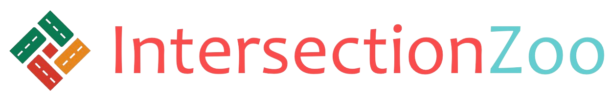

Welcome to IntersectionZoo
===================================

IntersectionZoo is a cooperative eco-driving-based multi-agent reinforcement learning environment for benchmarking contextual reinforcement 
learning algorithms to assess their generalization capabilities. Additionally, it also aims to advance eco-driving research by providing standardized environments for benchmarking eco-driving algorithms.

Why IntersectionZoo?
--------------------

Despite the success of multi-agent reinforcement learning (RL) in simulated applications, its success in real-world applications has been rather limited. 
A key challenge lies in making multi-agent RL generalize across problem variations, a common requirement in many real-world problems. 
Contextual reinforcement learning (CRL) formalizes learning policies that generalize across problem variations. 
However, the lack of standardized benchmarks for multi-agent CRL that are based on real-world applications and also capture the open challenges of real-world problems that affect generalization (e.g., partial observability and multiple competing objectives) has hindered progress. 
To bridge this gap, we introduce IntersectionZoo, a comprehensive benchmark suite for assessing multi-agent CRL algorithms through the real-world application of cooperative eco-driving in urban road networks. 
Eco-driving aims to control a fleet of vehicles to reduce fleet-wise emissions and encodes many of the open challenges in real-world problems. IntersectionZoo is built on data-informed simulations of 16,334 signalized intersections derived from 10 major US cities, modeled in an industry-standard microscopic traffic simulator. 
By modeling factors affecting vehicular exhaust emissions (e.g., temperature, humidity), IntersectionZoo provides one million traffic scenarios encoded as Contextual Markov Decision Processes for assessing CRL algorithms. 

Beyond supporting benchmarking multi-agent CRL algorithms, IntersectionZoo also presents an opportunity to improve cooperative eco-driving. 
Eco-driving is well known for its potential impact on climate change mitigation goals. The automotive industry actively researches robust eco-driving controllers. 
Therefore, by introducing IntersectionZoo, we also aim to engage the machine-learning community in solving the eco-driving problem.

Publications and Citation
-------------------------

If you use IntersectionZoo in your work, you are highly encouraged to cite our paper:

V. Jayawardana, B. Freydt, A. Qu, C. Hickert, Z. Yan, C. Wu, `IntersectionZoo: Eco-driving for Benchmarking Multi-Agent Contextual Reinforcement Learning <https://openreview.net/forum?id=XoulHHQGFi>`_, International Conference on Learning Representations (ICLR) 2025.

License
-------

IntersectionZoo is licensed under the MIT License. See the `LICENSE <https://github.com/mit-wu-lab/IntersectionZoo/blob/main/LICENSE>`_ file for more information.

Contents
--------

.. toctree::

   usage
   main_concepts
   intersectionzoo_architecture
   rllib_integration
   tutorial
   benchmarking
   extensions
   contact
