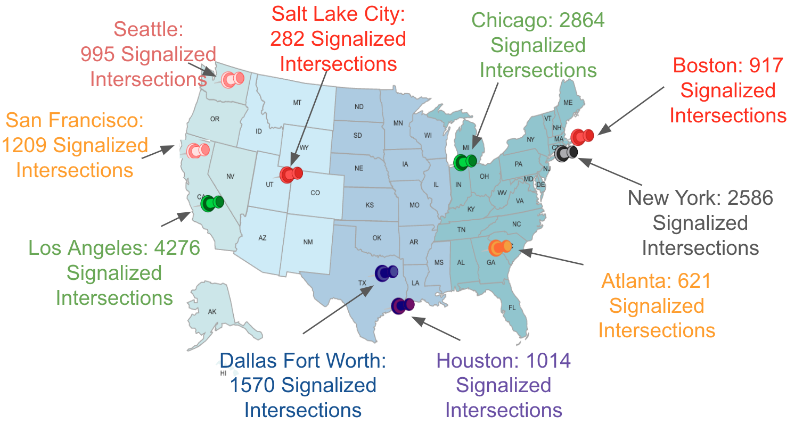
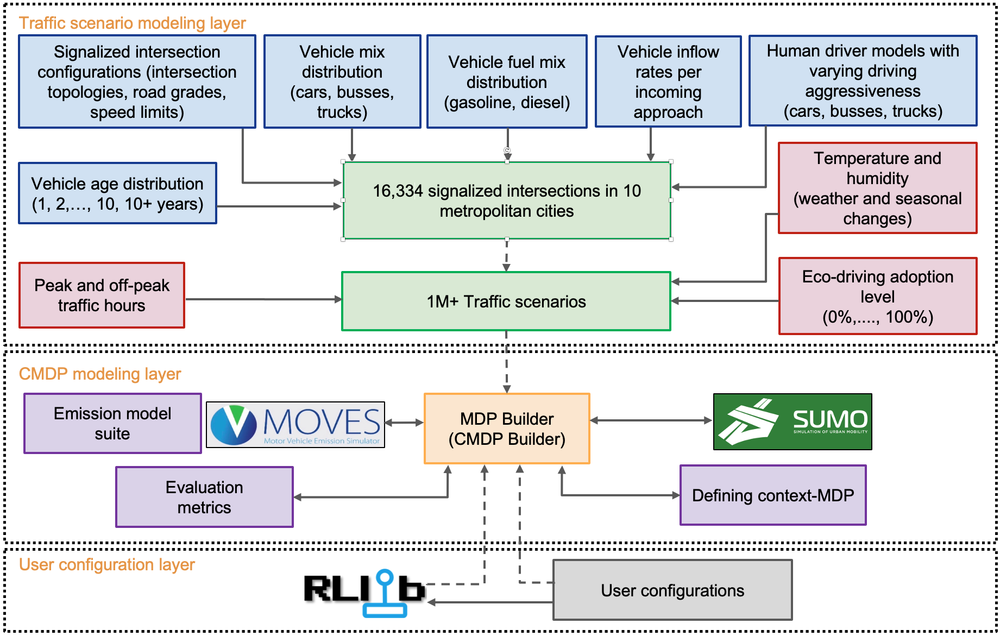
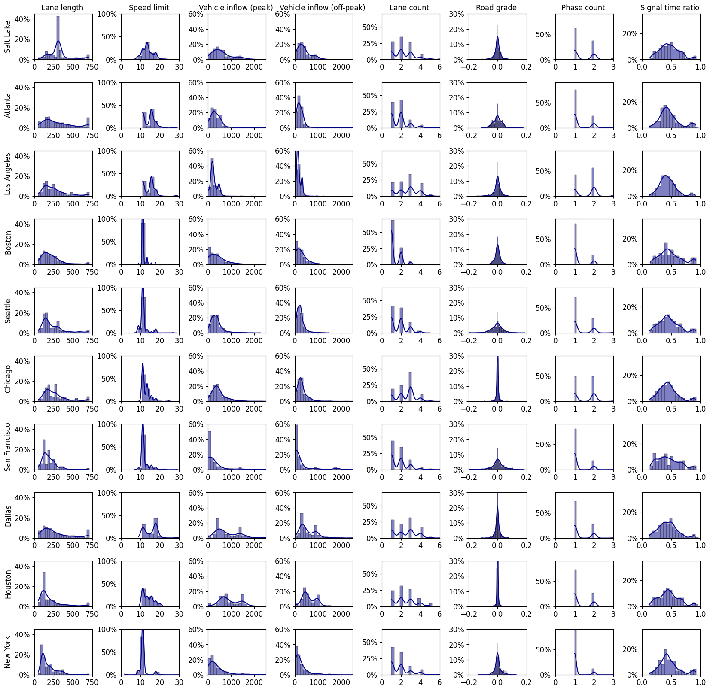

.. _intersectionzoo_architecture:

IntersectionZoo Overview
========================

Overview
------------

IntersectionZoo builds more than one million data-driven traffic scenarios around 16,334 signalized intersections in 10 major cities across United States. The figure below shows the 
10 cities and the number of intersections in each city.

In building IntersectionZoo, three main logical layers are used to abstract functionality as shown in the following figure.

\

Traffic Scenario Modeling
-------------------------

In the **traffic scenario modeling layer**, we first build data-driven simulation environments of signalized intersections and then use them to build traffic scenarios at those
intersections. Concretely, an intersection is first defined by factors such as lane lengths, lane counts, road grades, turn lane configuration, and speed limit of each approach. 
Then, vehicle type, age, and fuel type distributions are used with appropriate traffic flow rates and human driven vehicle behaviors to define a realistic traffic flow. 
Each intersection is then used to define traffic scenarios by further assigning representative atmospheric temperature and humidity values based on the season. 
Further scenario variations can be achieved by changing the eco-driving adoption level (0%-100%). 

The factors considered and data sources used for modeling them is given in the following table. 

.. list-table:: Eco-driving factors, data sources, and notes
   :widths: 15 30 65
   :header-rows: 1

   * - Factor
     - Data Source
     - Notes
   * - Intersection topology
     - Open Street Maps
     - Followed the guidelines from `Qu et al. (2023) <https://arxiv.org/abs/2405.13480>`_ to extract intersection topology from Open Street Maps.
   * - Speed limits
     - Open Street Maps
     - 
   * - Road grades
     - US geological surveys
     - 
   * - Vehicle inflow
     - Annual Average Daily Traffic (AADT) data
     - Collected from each city transportation department open data portal
   * - Driving hour (peak/off-peak)
     - Standard conversion rates
     - Taken from `Precision Traffic and Safety <https://www.precisiontrafficsafety.com/solutions/traffic-studies/>`_. 
   * - Vehicle arrival process
     - Realistic vehicle arrival process based on nearby intersections
     - For every intersection, a set of default nearby intersections \
       are added as a way of achieving realistic vehicle arrival \ 
       processes subjected to nearby traffic signal dynamics.
   * - Traffic Signal Timing
     - Optimal traffic signal plan
     - Exhasutively search through `Fixed Time <https://nacto.org/publication/urban-street-design-guide/intersection-design-elements/traffic-signals/fixed-vs-actuated-signalization/>`_ traffic signal plans \
       to find the optimal plan for each intersection.
   * - Vehicle age distribution
     - MOVES database
     - Taken from open database of `MOVES <https://www.epa.gov/moves>`_.
   * - Fuel type distribution
     - MOVES database
     - Taken from open database of `MOVES <https://www.epa.gov/moves>`_.
   * - Vehicle type distribution
     - MOVES database
     - Taken from open database of `MOVES <https://www.epa.gov/moves>`_.
   * - Temperature and humidity
     - US National Centers for Environmental Information
     - All processes data are available here `MOVES <https://docs.google.com/spreadsheets/d/1IxSaxkgkE9tA21u5CtSUVWJPa15QfLHT/edit?usp=sharing&ouid=111770128718724110720&rtpof=true&sd=true>`_ \
       for each city under each season (Fall, Spring, Summer and Winter) \
       and under different weather conditions (sunny, rain, snow).
   * - Human driver models
     - Intelligent Driver Model (IDM) callibrated with real-world data.
     - Calibration method is adopted from `Zhang et al. (2022) <https://arxiv.org/abs/2210.03571>`_ and \
       the data is taken from `CitySim dataset <https://github.com/UCF-SST-Lab/UCF-SST-CitySim1-Dataset>`_ \
       released under Apacahe 2.0 License.
   * - Eco-driving adoption level
     - Any user prefered value between 0%-100% 
     -
   * - Engine type
     - Internal combusion engines and electric engines as user prefered.
     - 

Intersection Feature Distribution
^^^^^^^^^^^^^^^^^^^^^^^^^^^^^^^^^

In the following figure, we show the distribution of the intersection features across the 10 cities. 
The full dataset of 16,334 intersections in compliance with SUMO simulator can be found in the `here <https://drive.google.com/drive/folders/1y3W83MPfnt9mSFGbg8L9TLHTXElXvcHs?usp=sharing>`_. 
To be used with the IntersectionZoo, the dataset should be placed in the `dataset` folder.

\

CMDP modeling
-------------

Once traffic scenarios are modeled, the **CMDP modeling layer** is used to contain them as `Conextual Markov Decision Process (CMDP) <https://arxiv.org/abs/1502.02259>`_ and define the state, action, reward to be used with the reinforcement learning algorithms. 
CMDP is used to model problem variations. In IntersectionZoo, each city is modeled as a CMDP with each traffic scenario stemming from the city as a problem variation. In a CMDP, each problem
variation is an MDP defined by a problem variation context and called a context-MDP. In eco-driving, those context-MDPs are defined by the following state, action and reward functions and formulate as a multi-agent control problem.

Context-MDP Definition
^^^^^^^^^^^^^^^^^^^^^^

- **State**: The design of the observed state of a vehicle is mainly based on the capabilities of existing sensor technologies. 
  The observed state includes the speed of the ego-vehicle, relative distance to the traffic signal, traffic signal state (red, green, or yellow) 
  for the current phase, time remaining in the current phase, time remaining until the traffic signal turns green for the second and third cycle, 
  vehicle location (i.e., a flag indicating whether the vehicle is approaching the intersection, at the intersection, or exiting the intersection), 
  index of the vehicle's current lane, vehicle's intention to turn right, left, or go straight at the upcoming intersection, and for the follower 
  and the leader vehicles on the same lane, adjacent right lane, and left lane of the ego-vehicle: speed, relative distance, turn signals status (turning right, left, or none).

  For users interested in conditioning the policies based on the context, we provide controlled context features that include eco-driving adoption level, 
  signal timing plan for the traffic signal phase relevant to the vehicle, atmospheric conditions such as temperature and humidity, the fuel type (electric or internal combustion engine), 
  and information about the ego-vehicle's current approach (number of lanes, lane length, speed limit). The decision on which features 
  are available for conditioning is also based on the feasibility of implementing them in the real world. 

- **Action**: Longitudinal acceleration of each controlled vehicle. For lane changing, a standard rule-based controller is used. This focuses IntersectionZoo on the continuous control aspect of eco-driving.
  
- **Reward** The reward :math:`r_i^t` for each controlled vehicle :math:`i` at time :math:`t` is defined as in the following equation. 
  Here, :math:`n` is the vehicle fleet size, :math:`v_t^i` is the velocity, and :math:`e_t^i` is the CO\ :sub:`2` emissions of vehicle :math:`i` at time :math:`t`. 
  Hyperparameters include :math:`\eta`, :math:`\alpha`, :math:`\beta`, and :math:`\tau`. 
  The indicator function :math:`1_{v^i_t < \tau}` indicates whether the vehicle is stopped, while the term :math:`e_t^i` encourages low emissions. 
  The velocity term captures the effect on travel time. Users can configure the parameter :math:`\eta` to either get a fleet-based reward, agent-based reward, or a combination of both. All such formulations are acceptable.

.. math::
   r_t^i = \eta \frac{1}{n}\sum_{i=0}^{n} (v_t^i + \alpha 1_{v^i_t < \tau} + \beta e_t^i) + (1-\eta)(v_t^i + \alpha 1_{v^i_t < \tau} + \beta e_t^i)

IntersectionZoo provides additional objective terms for users who wish to assess the effect of multiple objectives on generalization.

**Passenger comfort**: To accommodate passenger comfort, vehicles should maintain low accelerations and decelerations. 
To encourage this behavior, a reward term is defined as :math:`|a_t|` where :math:`a_t` is the acceleration (or deceleration) of 
the vehicle at time :math:`t`. When used with shared fleet-wise reward, the mean of :math:`|a_t|` across all vehicles is used.

**Kinematic realism**: Vehicles often cannot have high jerks (changes in accelerations in unit time) as actuators have jerk limits. 
To account for this, IntersectionZoo provides jerk control as :math:`|a_{t} - a_{t-1}|` where :math:`a_t` is the acceleration (or deceleration) of 
the vehicle at time :math:`t`. When used with shared fleet-wise reward, the mean jerk across all vehicles is used.

**Fleet-level safety**: While individual vehicle safety is ensured using pre-defined rule-based checks, 
IntersectionZoo provides surrogate safety measures such as Time To Collision (TTC) to improve traffic flow level safety. 
These surrogate safety measures are commonly used by traffic engineers to measure the impact of new roadway interventions.

Time to Collision (TTC) for a vehicle is measured as the time it would take for the vehicle to collide if they were to 
continue moving along their current paths without any changes in speed or direction. Formally, :math:`TTC = \frac{\Delta d}{\Delta v}` where :math:`\Delta d` 
is the relative distance and :math:`\Delta v` is the relative velocity. Both distance and velocity are measured relative to 
the leading vehicle of the ego-vehicle. In using TTC for fleet-level safety, we take the minimum TTC value across all vehicles at a given time step and share it with all vehicles.

Emission Models
^^^^^^^^^^^^^^^

A key requirement for capturing the effect of traffic scenarios on vehicle exhaust emission is a rich emission function.
For this prupose, IntersectionZoo comes with an intergrated `NeuralMOVES <https://www.climatechange.ai/papers/neurips2022/90>`_, a suite of comprehensive and fast neural emission models 
that replicate the industry-standard `Motor Vehicle Emission Simulator (MOVES) <https://www.epa.gov/moves>`_. We intregrate 88 vehicle exhasut emission models for differnet vehicle types under varying conditions. 
Intereted users can find the full list of vehicle emission models in the `NeuralMOVES <https://www.climatechange.ai/papers/neurips2022/90>`_ paper.

User configuration
------------------

In **user configuration layer**, we provide users the flexibility to configure their experimental setup. 

RLLib
^^^^^
By defualt, IntersectionZoo is intergrated with 
`RLlib <https://docs.ray.io/en/latest/rllib/index.html>`_, a scalable reinforcement learning library that provides a unified API for testing and 
benchmarking reinforcement learning algorithms. For more details on how to use IntersectionZoo with RLlib, please refer to the `RLlib intergration <https://intersectionzoo-docs.readthedocs.io/en/latest/rllib_integration.html>`_ section.