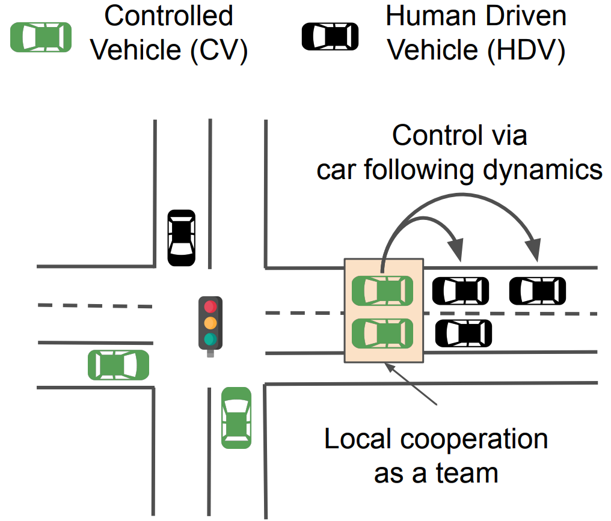

.. _main_concepts_eco_driving:

Introduction to Eco-driving
===========================

.. _eco_driving:

Cooperative Eco-driving
-----------------------

In a mixed traffic environment, the behavior of human-driven vehicles (HDVs) can be influenced by the behavior of controlled vehicles (CVs). Here, 
the controlled vehicles can be autonomous vehicles or even vehicles with adavanced driver assistance systems (ADAS).
In the following figure, we show an example of cooperative eco-driving at signalized intersections where CVs are controlled to 
minimize the total exhaust emissions of the fleet (both CVs and HDVs) while minimizing the impact on the travel time of each vehicle. 
While CVs are controllable by some defined eco-driving strategy, HDVs are driven by humans and can not be controlled. However, CVs implicitly control HDVs 
through car-following dynamics and by forming locally cooperative teams for better system control 
(by controlling the oppotunities of HDVs to overake CVs). In IntersectionZoo, we focus on the problem of cooperative eco-driving at signalized intersections by 
controlling the longitudinal accelerations of CVs. Lane changing of both CVs and HDVs are controlled by rule-based defualt models of SUMO traffic simulator. 

Concreately, the default objective of cooperative eco-driving at individual signalized intersections is to minimize the total exhaust emissions of a 
fleet of vehicles consisting of both Controlled Vehicles (CVs) and Human Driven Vehicles (HDVs) 
while having a minimal impact on individual travel time of vehicles. At a given time :math:`t`, the number of CVs is :math:`k_{CV}^t`, 
and HDVs is :math:`k_{HDV}^t` such that :math:`k_{CV}^t + k_{HDV}^t = n^t` where :math:`n^t` is the total number of vehicles in the fleet. 
Then, we control the longitudinal accelerations of all CVs decentrally using a learned policy to optimize.

.. math::

   \min J = \sum_{i=1}^{n} \sum_{t=0}^{T_i} E\left(a_i(t), v_i(t)\right) + \lambda T_i.

Here, :math:`T_i` denotes the travel time of vehicle :math:`i` and time :math:`t` is a discretized time with increments of :math:`\delta` 
(we use 0.5 seconds).The vehicular exhaust emission function is denoted by :math:`E(\cdot)`, which takes speed :math:`v_i(t)` and acceleration :math:`a_i(t)` 
of vehicle :math:`i` at time :math:`t` and outputs a vehicular emission amount (usually the amount of carbon dioxide). :math:`\lambda` 
is the trade-off hyperparameter. We seek to optimize :math:`J` subject to hard constraints of ensuring vehicle safety, 
connectivity via vehicle-to-vehicle and vehicle-to-traffic signal communication, and soft constraints of vehicle kinematics, 
control realism, traffic safety at the fleet level (e.g., minimum time to collision across all vehicles), and passenger comfort.

Cooperative Eco-driving at City Scale
-------------------------------------

Optimizing eco-driving across a full-traffic network is ideal but is impractical in large cities like Los Angeles, with nearly 5000 signalized intersections, 
and remains an open optimization challenge. A common approach is to decompose the network into individual intersections for separate optimizations while 
regulating intersection throughput to prevent traffic spill-back due to possible increased throughput. Therefore, it is often assumed that vehicle 
flow is not at saturation, allowing for reasonable throughput improvements. By default, we adopt the same modeling assumption in intersectionZoo. However, prefered 
users can choose to regulate throughput according to their methods or estimate potential for improvement in throughput at each intersection. 

Then, given a city-scale traffic network, we can model each intersection separately. However, each signalized intersection yeilds multiple 
traffic scenarios due to the factors such as weather, time of day, and traffic demand and eco-driving adoption level. 
Therefore, we need to optimize the eco-driving policy for across all these scenarios. 

Consider a city comprised of traffic scenarios :math:`\Phi` where :math:`|\Phi|` is large (e.g., millions of traffic scenarios). 
Let :math:`\pi^e :=  (\pi^e_{\phi})_{\phi \in \Phi}` denote the set of eco-driving control laws. 
Similarly, let :math:`\pi^b :=  (\pi^b_{\phi})_{\phi \in \Phi}` denote the baseline (status quo driving). 
Let :math:`f(\pi, \phi)` denote a function that captures the CO\ :sub:`2` emission for the scenario :math:`\phi` under the control law :math:`\pi`. 
We then define the *regional eco-driving effectiveness* as,

.. math::

   E_{\Phi}(\pi^e, \pi^b) := 1 - \frac{\mathbb{E}_{\phi \in \Phi} [f(\pi^e_{\phi}, \phi)]}{\mathbb{E}_{\phi \in \Phi} [f(\pi^b_{\phi}, \phi)]}

We thus seek to solve the *regional eco-driving problem* for the control laws :math:`\pi^e` such that,

Find

.. math::

   \pi^e = \arg\max_{\pi} E_{\Phi}(\pi, \pi^b)

subject to,

.. math::

   n_{\phi}^{e} \geq n_{\phi}^{b} \quad \forall \; \phi \in \Phi

where :math:`n_{\phi}^{e}` and :math:`n_{\phi}^{b}` denote the intersection throughput for scenario :math:`\phi` under the control laws of :math:`\pi^e_{\phi}` and :math:`\pi^b_{\phi}`, respectively.

Additional Reads
---------------

An interetsed reader is encouraged to read the following papers for more details on eco-driving:

**[1]**: *Mintsis, Evangelos, Eleni I. Vlahogianni, and Evangelos Mitsakis. "Dynamic eco-driving near signalized intersections: Systematic review and future research directions." Journal of Transportation Engineering, Part A: Systems 146, no. 4 (2020): 04020018.*
**[2]**: *Huang, Yuhan, Elvin CY Ng, John L. Zhou, Nic C. Surawski, Edward FC Chan, and Guang Hong. "Eco-driving technology for sustainable road transport: A review." Renewable and Sustainable Energy Reviews 93 (2018): 596-609.*
**[3]**: *Xu, Nan, Xiaohan Li, Qiao Liu, and Di Zhao. "An overview of eco-driving theory, capability evaluation, and training applications." Sensors 21, no. 19 (2021): 6547.*
**[4]**: *Barkenbus, Jack N. "Eco-driving: An overlooked climate change initiative." Energy policy 38, no. 2 (2010): 762-769.*
