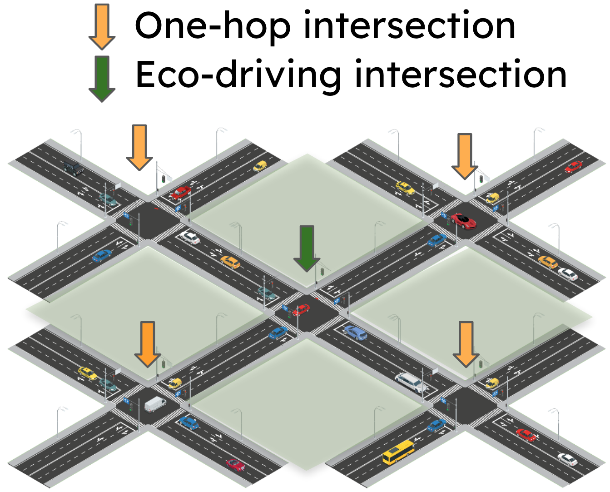

.. _simulation_setup:

Simulation setup
================

The simulation environment is built upon the open-source traffic microsimulator SUMO (Simulation of Urban MObility). It models signalized intersections across ten major US metropolitan cities, including Manhattan (New York), Boston, San Francisco, Los Angeles, Seattle, Houston, Dallas-Fort Worth, Salt Lake City, Chicago, and Atlanta.

Each simulation focuses on a single "control active intersection" where the impact of eco-driving is evaluated. This intersection is modeled in detail, with its layout, including lane lengths, lane counts, turn lane configurations, and speed limits, extracted from OpenStreetMap (OSM) data. Road grades are obtained from US geological surveys. Missing values in OSM data are imputed using established guidelines.

To ensure realistic traffic flow, the control active intersection is surrounded by "ghost intersections" representing its immediate one-hop neighbors. These ghost intersections are modeled with default SUMO traffic signal timing and are not actively controlled for eco-driving. Their purpose is to provide realistic vehicle inflows to the control active intersection.

Vehicle inflows for both the control active and ghost intersections are modeled using Annual Average Daily Traffic (AADT) data, with standardized conversion rates applied to differentiate peak and off-peak hour traffic. Traffic signal timing at the control active intersection is optimized through an exhaustive search within a predefined range, while ghost intersections use default SUMO timing plans.

Pedestrians and cyclists are assumed to adhere to traffic regulations, using marked crosswalks and designated bike lanes, respectively. Unprotected left turns are not modeled, and all turns are assumed to be protected. Light-duty trucks are primarily modeled, reflecting their prominence in urban areas.

Emission modeling utilizes fast surrogate neural network models trained on data from the Motor Vehicle Emission Simulator (MOVES). These models capture the cumulative effects of various factors, including vehicle maintenance, model, characteristics, road types, aerodynamic drag, air conditioning, and vehicle load, simplifying scenario modeling. Human driver behavior is simulated using the Intelligent Driver Model (IDM), calibrated using real-world arterial driving data from CitySim.